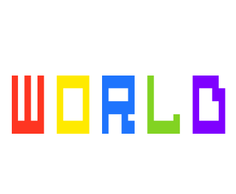

  

<h3 align="center">A super short "game" made for a friend</h3>

---

## Credits:

- Turn based combat from [SilentStares Art and More!](https://www.youtube.com/channel/UC7u4PyiLhRcVSzBiSRraXpQ) find the original code [here](https://github.com/SilentStares/FreeTurnBasedCombatGodot)
- [Kullix](https://www.youtube.com/@Kullix) I stole some music from him:
    - [FNF Ghosties Average](https://soundcloud.com/purpl3-g4laxy/fnf-ghosties-average-main-menu-theme)
    - [Supperfast](https://soundcloud.com/purpl3-g4laxy/supperfast-fnf-ghosties-pause-theme)
    - [explambamsz](https://soundcloud.com/purpl3-g4laxy/explambamsz)
    - [brash](https://on.soundcloud.com/narQQeZoquT7siw2xD)
- Scott Cawthon - Borrowed some FNAF World tracks
    - [FNaF World OST - 8 Bit Travel 1](https://youtu.be/_OAJNYfQOfk?si=9oUEAwSrjW4Fx6RK)
    - [FNaF World OST - City Theme](https://youtu.be/jodqNCCUMV8?si=N_7wflbyq2t4KfqL)
- [Krappy Kazoo](https://www.youtube.com/@krappykazoo):
    - [Happy Birthday (Krappy Kazoo)](https://www.youtube.com/watch?v=I5yOi9UKi8A)
---

## How It Plays

Once you press play you'll be greated with the tutorial, where you have the option to either Spare or Kill. The game has 3 enemies each with different stats and 1 boss. Spare or kill in order to get one of the 4 endings.

---

## Controls

- WASD to move
- And your mouse to click on stuff

---

